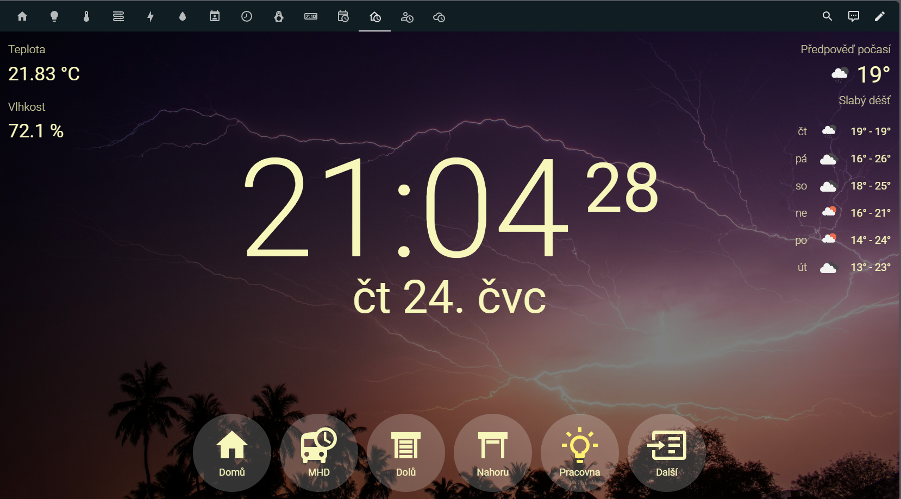

# Wall Clock Card for Home Assistant

A simple, elegant card for Home Assistant's Lovelace UI that displays a clock with seconds and the current date. The card also features weather information display and customizable backgrounds with support for various image sources including local images, Picsum Photos, and Unsplash.



## Our Story

This project started with a simple need: a beautiful, functional clock for our refrigerator-mounted tablet running Home Assistant. We wanted an at-a-glance display of time, date, and weather that would be visible from anywhere in the kitchen.

Junie from JetBrains took on the programming challenge, creating a clean, elegant solution using TypeScript and modern web components. What began as a simple clock quickly evolved to include weather forecasts, sensor displays and beautiful background images.

Today, our Wall Clock Card serves as the central information hub on our kitchen tablet, providing all the essential information we need throughout the day in a visually pleasing package.

## Features

- **Beautiful clock display**:
  - Large, centered clock with hours, minutes, and seconds
  - Date display with weekday, month, day, and optional year
  - Automatically updates every second
  - Uses Home Assistant's theme colors
  - Configurable date and time formats
  - Configurable time zone (defaults to Home Assistant's time zone)
  - Configurable font color (default: white)

- **Sensor integration**:
  - Display multiple sensors in the top left corner
  - Customizable labels for each sensor
  - Automatic updates when sensor values change

- **Weather forecast**:
  - Display current weather and forecast in the top right corner
  - Current temperature and conditions with icon
  - Multi-day forecast with temperature ranges (1-7 days)
  - Configurable display mode (current, forecast, or both)
  - Customizable weather section title
  - Weather data automatically updates at configurable intervals (default: 30 minutes)
  - Supports OpenWeatherMap API (free tier)
  - Localization for weather conditions in multiple languages (English, Czech, German, Slovak, Polish, Spanish, French, Russian)
  - Simplified weather categories for better readability

- **Background images**:
  - Multiple image sources with automatic rotation
  - Adjustable black overlay for better text readability
  - Configurable rotation interval
  - Weather and time-of-day based image selection
  - Lazy loading for improved performance
  - Automatic preloading for smooth transitions

- **Image sources**:
  - **Extensible image source system**:
    - Abstract base class for easy creation of custom image sources
    - Factory pattern for image source instantiation
    - Registry for managing image sources
    - Comprehensive documentation in [image-source-documentation.md](docs/developer/image-source-documentation.md)
  - **Local images**:
    - Support for your own image collection
    - Weather and time-of-day based image selection
    - Directory-based image loading with automatic categorization
    - Filename pattern matching for easy organization

  - **Picsum Photos**:
    - Random high-quality images
    - No API key required
    - Fast and reliable

  - **Unsplash**:
    - Beautiful, free photos from Unsplash collections
    - Weather and time-of-day based image selection
    - Temperature-based image queries (cold/hot modifiers)
    - Fresh images on each rotation

  - **Sensor Images**:
    - Uses images from a Home Assistant sensor with a "files" attribute
    - Images are automatically cached and refreshed every 10 minutes
    - Supports weather and time-of-day recognition from image URLs
    - Automatically filters images based on current weather conditions and time of day

- **Configuration**:
  - Full visual editor in Home Assistant UI
  - Comprehensive YAML configuration options
  - Individual background image management
  - Language selection for weather conditions

## Installation

### Manual Installation

1. Create a `www/wall-clock-card` folder in your Home Assistant configuration directory
2. Download the `wall-clock-card.js` file from the `dist` folder of this repository
3. Place the file in the `www/wall-clock-card` folder
4. Add the following to your `configuration.yaml`:

```yaml
lovelace:
  resources:
    - url: /local/wall-clock-card/wall-clock-card.js
      type: module
```

5. Restart Home Assistant

### HACS Installation

[](https://my.home-assistant.io/redirect/hacs_repository/?owner=rkotulan&repository=ha-wall-clock-card&category=plugin)

1. Open HACS in your Home Assistant instance
2. Search for "Wall Clock Card"
3. Click on the "Wall Clock Card" in the search results
4. Click "Download" in the bottom right corner
5. HACS will automatically add the required resource to your Lovelace configuration
6. Restart Home Assistant if needed

## Usage

After installation, you can add the card to your Lovelace dashboard:

1. Edit your dashboard
2. Click the "+" button to add a new card
3. Search for "Wall Clock" or scroll down to find it
4. Configure the card as needed
5. Click "Save" to add it to your dashboard

Alternatively, you can add it manually to your Lovelace configuration:

```yaml
type: 'custom:wall-clock-card'
# Additional configuration options...
```

## Documentation

For detailed documentation, please see the following pages:

- [Configuration](docs/configuration.md) - How to configure the card through UI or YAML
- [Sensors](docs/sensors.md) - How to configure sensors display
- [Image Sources](docs/image-sources.md) - Available image sources and how to configure them
- [Weather](docs/weather.md) - Weather configuration options
- [Background Handling](docs/background-handling.md) - How background images are handled
- [Development](docs/developer/development.md) - Information for developers

## License

MIT
