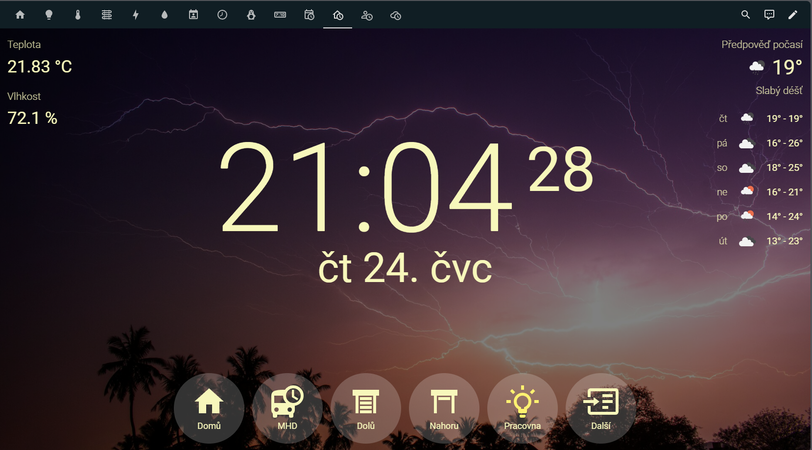

# Wall Clock Card for Home Assistant

Wall Clock Card is a full-screen-friendly Lovelace card for clocks, dashboards and
wall panels. Version 3.0 introduces a visual Designer with a 3×3 zone grid: place
clock, date, sensors, weather, calendars, public transport and action buttons where
they make sense for your screen.



## Highlights in 3.0

- Nine responsive zones with touch-capable drag and drop.
- Multiple instances of most widgets; transportation remains a singleton.
- Card, zone and per-widget inspectors with continuous saving in dashboard edit mode.
- Clock and date formatting, sensor orientation/alignment and configurable action bars.
- Home Assistant and OpenWeatherMap weather providers.
- Calendar agenda with multiple calendars and an event-detail dialog.
- On-demand IDS JMK/DPMB departures.
- Local, Picsum, Unsplash and Home Assistant sensor-backed backgrounds.
- Automatic in-memory migration of existing 2.x configurations.
- Czech and English Designer UI; weather-condition translations cover additional languages.

## Installation

### HACS (recommended)

[](https://my.home-assistant.io/redirect/hacs_repository/?owner=rkotulan&repository=ha-wall-clock-card&category=plugin)

1. Open HACS and search for **Wall Clock Card**.
2. Download the card.
3. Reload the browser if HACS asks you to do so.

HACS normally registers the JavaScript resource automatically. A Home Assistant
restart is not normally required.

### Manual installation

1. Copy `dist/wall-clock-card.js` to
   `/config/www/wall-clock-card/wall-clock-card.js`.
2. In **Settings → Dashboards → Resources**, add:

   ```text
   /local/wall-clock-card/wall-clock-card.js
   ```

   Select **JavaScript module** as the resource type.
3. Reload the dashboard. If an older bundle remains cached, append or increment a
   query parameter such as `?v=3.0.0` and perform a hard refresh.

For YAML-managed resources:

```yaml
lovelace:
  resources:
    - url: /local/wall-clock-card/wall-clock-card.js?v=3.0.0
      type: module
```

## Add and edit the card

Add **Wall Clock** from Home Assistant's card picker, or start with YAML:

```yaml
type: custom:wall-clock-card
```

The empty/default card contains clock and date widgets. To configure it:

1. Put the dashboard in edit mode.
2. On a regular dashboard card, select **Configure card**. Panel/full-screen cards open
   the Designer directly.
3. Use **Card settings** for general appearance, spacing and the background.
4. Drag widgets from the palette into zones. Select a widget or zone to edit it.
5. Changes are saved continuously. **Done** closes the card Designer; Home
   Assistant's dashboard **Done** completes dashboard editing.

Existing 2.x YAML is supported and is migrated in memory. Once the Designer saves a
change, the stored configuration uses the 3.0 `appearance`, `background` and
`layout.zones` structure.

## Minimal 3.0 example

```yaml
type: custom:wall-clock-card
appearance:
  language: cs
  fontColor: '#fff7bb'
  size: medium
background:
  source: picsum
  opacity: 0.3
  rotationInterval: 90
  objectFit: cover
layout:
  spacing: normal
  zones:
    top-left:
      widgets:
        - type: sensors
          sensors:
            - entity: sensor.living_room_temperature
              label: Temperature
    top-right:
      widgets:
        - type: weather
          provider: homeassistant
          providerConfig:
            entityId: weather.home
          displayMode: both
          forecastDays: 5
    center:
      widgets:
        - type: clock
        - type: date
    bottom-center:
      widgets:
        - type: action-bar
          enabled: true
          actions:
            - actionId: action-ha
              title: Home
              icon: mdi:home
              tap_action:
                action: navigate
                navigation_path: /lovelace/0
```

## Documentation

- [Configuration](docs/configuration.md) — Designer workflow, YAML and custom fonts
- [Zone layout](docs/layout.md) — zones, spacing, widgets and 2.x migration
- [Clock and date](docs/clock-date.md) — formatting, size and alignment
- [Sensors](docs/sensors.md)
- [Weather](docs/weather.md)
- [Calendar](docs/calendar.md)
- [Transportation](docs/transportation.md)
- [Action bar](docs/action-bar.md)
- [Action-bar plugin API](docs/action-bar-plugins.md)
- [Image sources](docs/image-sources.md)
- [Background behavior](docs/background-handling.md)
- [Development](docs/developer/development.md)
- [3.0.0 release checklist](docs/developer/release-checklist.md)
- [Changelog](CHANGELOG.md)

## Architecture at a glance

- `src/core/` — card shell, normalized configuration, migration and zone rendering
- `src/widgets/` — widget registry, built-in widget adapters and shared widget layout
- `src/components/` — feature components, controllers and feature editors
- `src/editors/` — Designer, inspectors and editor adapters
- `src/image-sources/` — background source registry and built-in sources
- `src/weather-providers/` — weather provider registry
- `src/transportation-providers/` — transport provider registry
- `src/components/action-bar/plugins/` — action plugins and their editors
- `src/utils/` — localization, logging and cross-component messaging
- `src/translations/` — Designer translations
- `tests/` — Jest tests for configuration and pure logic
- `dist/` — production bundle loaded by Home Assistant

See [Development](docs/developer/development.md) for the build and verification
workflow.

## License

MIT
